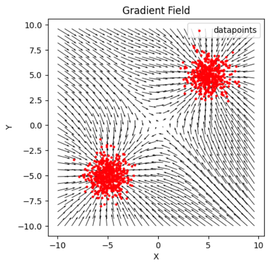
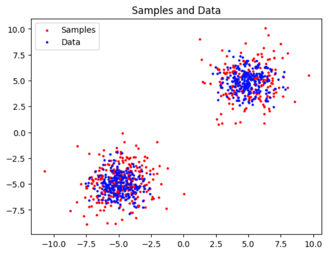

# Score based models

This repo contains some naive implementations of various score-based generative models.

## Installation

To install this library, simply run the following command after cloning the repo :
```shell
pip install -e .
```


## Methods

The supported methods are:
* Noise Conditional Score Networks (NCSN) ([Song and Ermon, 2019](https://arxiv.org/abs/1907.05600))


## Run

#### NCSN
* 2D gaussian example: `notebooks/ncsn_2d_example.ipynb`

* CIFAR 10: 

```shell
cd scripts
python ncsn_train_cifar10.py
```

## Results

#### NCSN

* 2D Gaussian mixture
<div style="display: flex;">
  
  
</div>

* CIFAR-10

