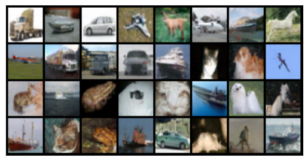

# Score based models

This repo contains some naive implementations of various score-based generative models.

## Installation

To install this library, simply run the following command after cloning the repo :
```shell
pip install -e .
```


## Methods

The supported methods are:
* Noise Conditional Score Networks (NCSN) ([Song and Ermon, 2019](https://arxiv.org/abs/1907.05600))
* Denoising Diffusion Probabilistic Models (DDPM) ([Ho et al., 2020](https://arxiv.org/abs/2006.11239))


## Run

### NCSN
* 2D gaussian example: `notebooks/ncsn_2d_example.ipynb`

* CIFAR-10: 

```shell
cd scripts
python ncsn_train_cifar10.py
```

You can visualise the CIFAR-10 samples in `notebooks/ncsn_view.ipynb`.


### DDPM
* 2D gaussian example: `notebooks/ddpm_2d_example.ipynb`

* CIFAR-10, Butterfiles: 

```shell
cd scripts
python ddpm_train_cifar10.py --dataset [dataset-name]
```

You can visualise the CIFAR-10 and Butterflies samples in `notebooks/ddpp_view.ipynb`.


## Results

### NCSN

* 2D Gaussian mixture


* CIFAR-10 (32 x 32)


### DDPM

* CIFAR-10 (32 x 32)



* Butterflies (128 x 128)


